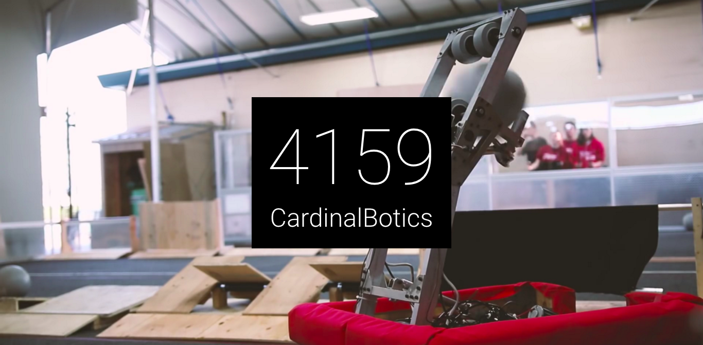

# FRCNewTab
Display information about a random FRC team in your new tab.

## Installation
To install from source:  
1. Clone or download files.  
2. Open Chrome Extensions page and activate Developer Mode.  
3. Load Unpacked Extension, and locate the extension folder.  
4. Select the folder and click open.  
5. If you like, click options to go to the configuration page.  