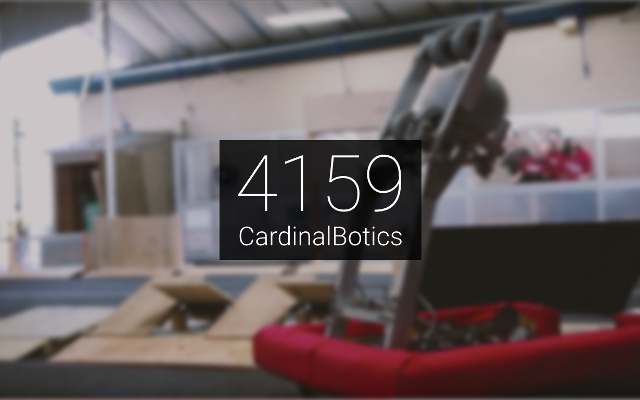
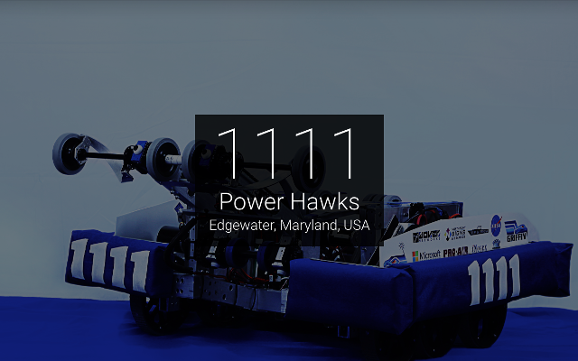
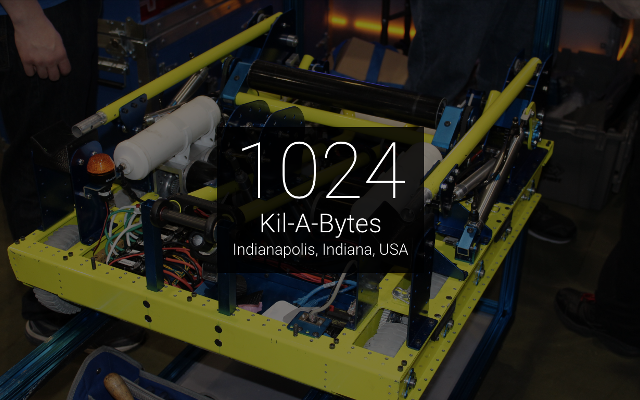

# FRCNewTab
Custom new tab page extension which displays information about a random FIRST Robotics Competition team along with a picture of their most recent robot.

## Installation
The packaged extension can be downloaded below:
* [Chrome](https://chrome.google.com/webstore/detail/agmoglelphhinnadfmbfodhkdagibkop/)
* [Firefox](https://addons.mozilla.org/en-US/firefox/addon/frc-new-tab/)
To install from source:  
1. Clone or download files.  
2. Open Chrome Extensions page and activate Developer Mode.  
3. Load Unpacked Extension, and locate the extension folder.  
4. Select the folder and click open.  
5. If you like, click options to go to the configuration page.  

This extension should work out of box. Settings can be configured in the Options link visible in the extensions menu.

## FAQ
### How do I add a photo for my team?
FRCNewTab retrieves team photos from The Blue Alliance's API. If you would like to add a new photo for your team, go to its page on The Blue Alliance (such as https://thebluealliance.com/team/1418) and click "Add new media" near the bottom of the page. You can also visit this page directly to submit media: https://www.thebluealliance.com/suggest/team/media?team_key=frcNUMBER&year=YEAR

## Packaging
The extension can easily be packaged into a zip for uploading to the Chrome Web Store by using GNU's `make` command. Simply navigate to the extension source directory and type `make`.

--------------------------------------------------------------------------------

This project is protected under the MIT license. More information in `LICENSE`.
